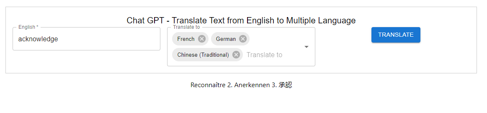

# Chat GPT - Translator

This is the sample code helps to understand basic Chat GPT API integration using ReactJS with Node expressJS. In this code We can translate the words from English to too many languages.

## Prerequisites
Signup and get your Own Chat GPT API key from [ChatGPT](https://chat.openai.com/).Replace your Environmental variable OPENAI_API_KEY=<APIKEY> in your .env file which is locatated in your backend folder

Install [nodemon](https://www.npmjs.com/package/nodemon)

## Installation

Run the below comments in both frontend and backend folder
```bash
npm install
```

## Launch the Application

Run the below comments in both frontend and backend folder to launch the application
```bash
npm start
```
## Sample OUTPUT



## Contributing

Pull requests are welcome. For major changes, please open an issue first
to discuss what you would like to change.


## License

[MIT](https://choosealicense.com/licenses/mit/)